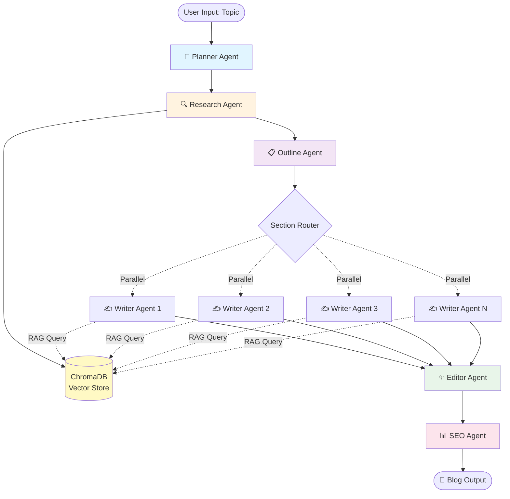

# 🤖 Agentic Blog Generator

A production-ready multi-agent blog generation system using **LangGraph** that autonomously creates high-quality blog content through specialized AI agents working in parallel.

[](https://www.python.org/downloads/)
[](https://github.com/langchain-ai/langgraph)
[](LICENSE)

---

## 🎯 Overview

This project demonstrates **multi-agent orchestration** using LangGraph, where six specialized AI agents collaborate through shared state to autonomously generate professional blog posts. The system features:

- 🔄 **Graph-based orchestration** with LangGraph StateGraph
- 🤝 **Collaborative agents** sharing state and context
- ⚡ **Parallel execution** for faster content generation
- 🔍 **RAG-powered writing** using ChromaDB vector store
- 🌐 **Web research** integration with Tavily API
- 📊 **SEO optimization** with metadata generation
- 📝 **Markdown output** with frontmatter

---

## 🏗️ Architecture



### Agent Workflow

1. **🎯 Planner Agent**: Analyzes topic → Creates structured plan
2. **🔍 Research Agent**: Web search → Summarizes → Stores embeddings
3. **📋 Outline Agent**: Combines plan + research → Generates section titles
4. **✍️ Writer Agents**: Write sections in parallel using RAG
5. **✨ Editor Agent**: Combines sections → Polishes content
6. **📊 SEO Agent**: Generates metadata + keywords + FAQ

---

## ✨ Features

### Core Capabilities
- ✅ **Multi-Agent Orchestration**: 6 specialized agents with distinct responsibilities
- ✅ **Parallel Processing**: Writer agents execute concurrently
- ✅ **RAG Integration**: Context-aware writing using vector database
- ✅ **Web Research**: Real-time web search via Tavily API
- ✅ **SEO Optimization**: Auto-generated metadata, keywords, and FAQ
- ✅ **State Management**: Shared BlogState flows through all agents
- ✅ **Error Handling**: Graceful fallbacks and retry logic

### Output Quality
- 📝 800-2000 word blog posts
- 🎨 Markdown formatting with proper structure
- 🔑 SEO-optimized titles and descriptions
- ❓ Auto-generated FAQ sections
- 📊 Keyword density analysis
- 🎯 Audience-appropriate tone

---

## 🚀 Quick Start

### Prerequisites

- Python 3.10 or higher
- OpenAI API key
- Tavily API key (for web research)

### Installation

1. **Clone the repository**
```bash
git clone https://github.com/ShreyashSoni/agentic_blog_generator.git
cd agentic-blog-generator
```

2. **Create virtual environment**
```bash
uv sync
source .venv/bin/activate
```

3. **Install dependencies**
```bash
uv pip install -r requirements.txt
```

4. **Set up environment variables**
```bash
cp .env.example .env
# Edit .env and add your API keys
```

Your `.env` file should contain:
```bash
OPENAI_API_KEY=your_openai_api_key_here
TAVILY_API_KEY=your_tavily_api_key_here
```

### Usage

**Basic usage:**
```bash
python app.py --topic "Introduction to Machine Learning"
```

**Specify output directory:**
```bash
python app.py --topic "RAG vs Fine-tuning" --output-dir my_blogs
```

**Enable verbose logging:**
```bash
python app.py --topic "Python Best Practices" --verbose
```

**Preview without saving:**
```bash
python app.py --topic "Blockchain Technology" --no-save
```

---

## 📁 Project Structure

```
agentic_blog_generator/
│
├── agents/                      # AI Agent implementations
│   ├── __init__.py
│   ├── planner.py              # Creates blog plan
│   ├── research.py             # Web research + vector storage
│   ├── outline.py              # Generates section outline
│   ├── writer.py               # Writes individual sections (RAG)
│   ├── editor.py               # Polishes final content
│   └── seo.py                  # Generates SEO metadata
│
├── memory/                      # Vector store management
│   ├── __init__.py
│   └── vector_store.py         # ChromaDB wrapper
│
├── workflows/                   # LangGraph orchestration
│   ├── __init__.py
│   └── blog_graph.py           # Workflow definition
│
├── prompts/                     # LLM prompt templates
│   ├── planner.txt
│   ├── writer.txt
│   └── editor.txt
│
├── outputs/                     # Generated blog files
│   └── .gitkeep
│
├── plans/                       # Architecture documentation
│   ├── architecture.md
│   ├── implementation_guide.md
│   └── technical_considerations.md
│
├── state.py                     # BlogState TypedDict definition
├── app.py                       # CLI entry point
├── requirements.txt             # Python dependencies
├── .env.example                 # Environment variable template
├── .gitignore                   # Git ignore rules
└── README.md                    # This file
```

---

## 🔧 How It Works

### 1. State Management

All agents share a common `BlogState` that flows through the graph:

```python
class BlogState(TypedDict):
    topic: str                    # User input
    plan: Dict                    # Structured plan
    research_docs: List[str]      # Research summaries
    outline: List[str]            # Section titles
    sections: Dict[str, str]      # Section content
    draft: str                    # Combined sections
    edited: str                   # Final polished blog
    seo_meta: Dict                # SEO metadata
```

### 2. Agent Interactions

```
User Input (topic)
    ↓
Planner → Creates plan with audience, length, sections, keywords
    ↓
Research → Searches web, stores embeddings in ChromaDB
    ↓
Outline → Generates structured section titles
    ↓
Writers → Write sections in parallel using RAG
    ↓
Editor → Combines and polishes content
    ↓
SEO → Generates metadata, keywords, FAQ
    ↓
Output (Markdown blog + metadata)
```

### 3. RAG Implementation

Writers use Retrieval-Augmented Generation:
1. Query vector store with section title
2. Retrieve top-3 relevant research chunks
3. Provide context to LLM for generation
4. Generate section with factual grounding

---

## 📊 Example Output

**Input:**
```bash
python app.py --topic "Understanding RAG in LLMs"
```

**Generated Blog:**
```markdown
---
title: "Understanding RAG: A Complete Guide to Retrieval-Augmented Generation"
description: "Learn how RAG enhances LLMs with real-time knowledge retrieval..."
keywords: [RAG, LLM, retrieval, vector database, embeddings]
slug: "understanding-rag-in-llms"
date: 2024-01-15
---

## Introduction
Retrieval-Augmented Generation (RAG) has emerged as a game-changing...

## What is RAG?
RAG combines the power of large language models with external knowledge...

[... more sections ...]

## Frequently Asked Questions

**Q: How does RAG differ from fine-tuning?**
A: RAG retrieves information at inference time, while fine-tuning...
```

**Console Output:**
```
======================================================================
📊 SEO METADATA
======================================================================

📝 Title: Understanding RAG: A Complete Guide to Retrieval-Augmented Generation
📄 Description: Learn how RAG enhances LLMs with real-time knowledge...
🔗 Slug: understanding-rag-in-llms

🔑 Keywords: RAG, LLM, retrieval, vector database, embeddings

📈 Keyword Density:
  • RAG: 2.3%
  • LLM: 1.8%
  • retrieval: 1.5%

❓ FAQ: 3 questions generated

======================================================================
```

---

## ⚙️ Configuration

### Environment Variables

| Variable | Required | Description |
|----------|----------|-------------|
| `OPENAI_API_KEY` | Yes | OpenAI API key for LLM operations |
| `TAVILY_API_KEY` | Yes | Tavily API key for web research |
| `OPENAI_MODEL` | No | Model to use (default: `gpt-4`) |

### Cost Estimation

Approximate costs per blog (using GPT-4):
- Planner: ~500 tokens (~$0.01)
- Research: ~2000 tokens (~$0.04)
- Writer: ~5000 tokens (~$0.10)
- Editor: ~3000 tokens (~$0.06)
- SEO: ~1000 tokens (~$0.02)

**Total per blog: ~$0.25**

For 100 blogs/month with optimizations: ~$30/month

---

## 🧪 Development

### Running Tests

```bash
# Install dev dependencies
pip install pytest pytest-cov

# Run tests
pytest tests/

# With coverage
pytest --cov=agents --cov=workflows tests/
```

### Adding a New Agent

1. Create agent file in `agents/` directory
2. Implement node function with signature: `(state: Dict[str, Any]) -> Dict[str, Any]`
3. Add agent to workflow in `workflows/blog_graph.py`
4. Create prompt template in `prompts/` if needed

---

## 🎓 Key Learning Outcomes

This project demonstrates:

✅ **Multi-agent orchestration** with LangGraph  
✅ **State-based workflow management**  
✅ **Parallel node execution patterns**  
✅ **RAG implementation** with vector stores  
✅ **Production-ready code structure**  
✅ **Clean architecture principles**  

---

## 📈 Future Enhancements

Potential improvements:

- [ ] Human-in-the-loop approval after outline
- [ ] Retry logic for sections < 200 words
- [ ] Hallucination detection layer
- [ ] Caching for research results
- [ ] Batch processing from CSV
- [ ] Image generation with DALL-E
- [ ] Multi-language support
- [ ] Custom tone/style templates

---

## 🤝 Contributing

Contributions are welcome! Please feel free to submit a Pull Request.

1. Fork the repository
2. Create your feature branch (`git checkout -b feature/AmazingFeature`)
3. Commit your changes (`git commit -m 'Add some AmazingFeature'`)
4. Push to the branch (`git push origin feature/AmazingFeature`)
5. Open a Pull Request