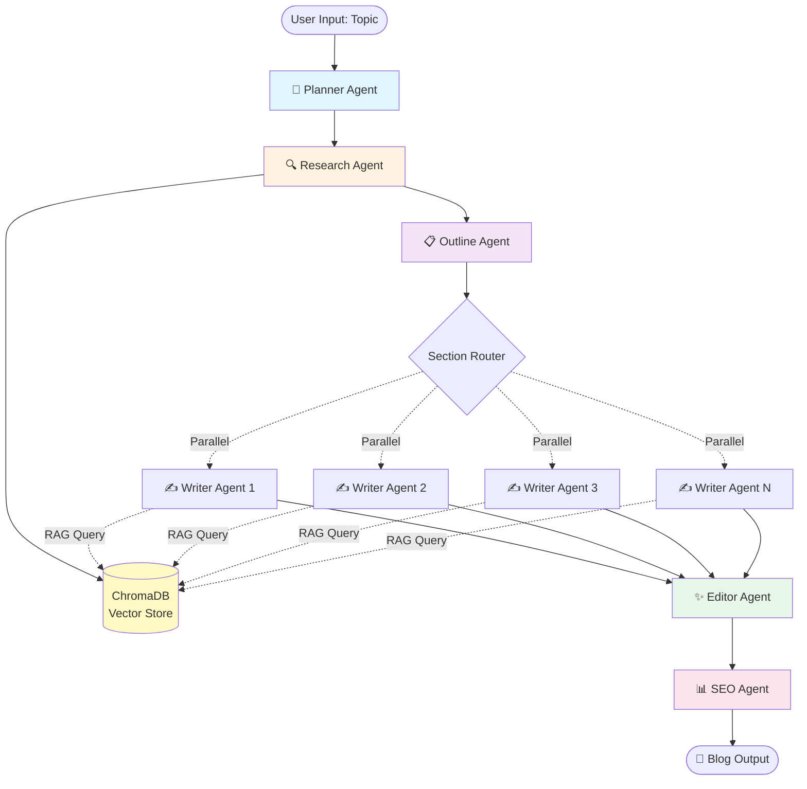

# 🤖 Agentic Blog Generator

A production-ready multi-agent blog generation system using **LangGraph** that autonomously creates high-quality blog content through specialized AI agents working in parallel.

[](https://www.python.org/downloads/)
[](https://github.com/langchain-ai/langgraph)
[](LICENSE)

---

## 🎯 Overview

This project demonstrates **multi-agent orchestration** using LangGraph, where six specialized AI agents collaborate through shared state to autonomously generate professional blog posts. The system features:

- 🔄 **Graph-based orchestration** with LangGraph StateGraph
- 🤝 **Collaborative agents** sharing state and context
- ⚡ **Parallel execution** for faster content generation
- 🔍 **RAG-powered writing** using ChromaDB vector store
- 🌐 **Web research** integration with Tavily API
- 📊 **SEO optimization** with metadata generation
- 📝 **Markdown output** with frontmatter

---

## 🏗️ Architecture


```mermaid
graph TB
    START([User Input: Topic]) --> PLANNER[🎯 Planner Agent]
    PLANNER --> RESEARCH[🔍 Research Agent]
    RESEARCH --> VSTORE[(ChromaDB<br/>Vector Store)]
    RESEARCH --> OUTLINE[📋 Outline Agent]
    OUTLINE --> ROUTER{Section Router}
    
    ROUTER -.Parallel.-> W1[✍️ Writer Agent 1]
    ROUTER -.Parallel.-> W2[✍️ Writer Agent 2]
    ROUTER -.Parallel.-> W3[✍️ Writer Agent 3]
    ROUTER -.Parallel.-> WN[✍️ Writer Agent N]
    
    W1 & W2 & W3 & WN --> EDITOR[✨ Editor Agent]
    EDITOR --> SEO[📊 SEO Agent]
    SEO --> END([📄 Blog Output])
    
    W1 & W2 & W3 & WN -.RAG Query.-> VSTORE
    
    style PLANNER fill:#e1f5ff
    style RESEARCH fill:#fff3e0
    style OUTLINE fill:#f3e5f5
    style EDITOR fill:#e8f5e9
    style SEO fill:#fce4ec
    style VSTORE fill:#fff9c4
```

### Agent Workflow

1. **🎯 Planner Agent**: Analyzes topic → Creates structured plan
2. **🔍 Research Agent**: Web search → Summarizes → Stores embeddings
3. **📋 Outline Agent**: Combines plan + research → Generates section titles
4. **✍️ Writer Agents**: Write sections in parallel using RAG
5. **✨ Editor Agent**: Combines sections → Polishes content
6. **📊 SEO Agent**: Generates metadata + keywords + FAQ

---

## ✨ Features

### Core Capabilities
- ✅ **Multi-Agent Orchestration**: 6 specialized agents with distinct responsibilities
- ✅ **Parallel Processing**: Writer agents execute concurrently
- ✅ **RAG Integration**: Context-aware writing using vector database
- ✅ **Web Research**: Real-time web search via Tavily API
- ✅ **SEO Optimization**: Auto-generated metadata, keywords, and FAQ
- ✅ **Social Media Content**: Auto-generate Twitter threads and LinkedIn posts
- ✅ **WordPress Publishing**: One-command publishing to WordPress as drafts
- ✅ **State Management**: Shared BlogState flows through all agents
- ✅ **Error Handling**: Graceful fallbacks and retry logic

### Output Quality
- 📝 2000-4000 word blog posts
- 🎨 Markdown formatting with proper structure
- 🔑 SEO-optimized titles and descriptions
- ❓ Auto-generated FAQ sections
- 📊 Keyword density analysis
- 🎯 Audience-appropriate tone
- 📱 Social media content (Twitter threads + LinkedIn posts)
- 📤 Direct WordPress publishing with categories and tags

---

## 🚀 Quick Start

### Prerequisites

- Python 3.10 or higher
- OpenAI API key
- Tavily API key (for web research)

### Installation

1. **Clone the repository**
```bash
git clone https://github.com/ShreyashSoni/agentic_blog_generator.git
cd agentic-blog-generator
```

2. **Create virtual environment**
```bash
uv sync
source .venv/bin/activate
```

3. **Install dependencies**
```bash
uv pip install -r requirements.txt
```

4. **Set up environment variables**
```bash
cp .env.example .env
# Edit .env and add your API keys
```

Your `.env` file should contain:
```bash
OPENAI_API_KEY=your_openai_api_key_here
TAVILY_API_KEY=your_tavily_api_key_here
```

### Usage

**Basic usage:**
```bash
uv run app.py --topic "Introduction to Machine Learning"
```

**Specify output directory:**
```bash
uv run app.py --topic "RAG vs Fine-tuning" --output-dir my_blogs
```

**Enable verbose logging:**
```bash
uv run app.py --topic "Python Best Practices" --verbose
```

**Preview without saving:**
```bash
uv run app.py --topic "Blockchain Technology" --no-save
```

---

## 📁 Project Structure

```
agentic_blog_generator/
│
├── agents/                      # AI Agent implementations
│   ├── __init__.py
│   ├── planner.py              # Creates blog plan
│   ├── research.py             # Web research + vector storage
│   ├── outline.py              # Generates section outline
│   ├── writer.py               # Writes individual sections (RAG)
│   ├── editor.py               # Polishes final content
│   ├── seo.py                  # Generates SEO metadata
│   └── social_media.py         # Generates social media content
│
├── memory/                      # Vector store management
│   ├── __init__.py
│   └── vector_store.py         # ChromaDB wrapper
│
├── services/                    # Service modules
│   ├── __init__.py
│   ├── markdown_parser.py      # Parse blog markdown files
│   ├── editor_service.py       # On-demand editing service
│   ├── social_media_service.py # Social media content service
│   └── wordpress_publisher.py  # WordPress REST API client
│
├── workflows/                   # LangGraph orchestration
│   ├── __init__.py
│   └── blog_graph.py           # Workflow definition
│
├── prompts/                     # LLM prompt templates
│   ├── planner.txt
│   ├── writer.txt
│   ├── editor.txt
│   ├── social_media_twitter.txt
│   ├── social_media_linkedin.txt
│   ├── social_media_images.txt
│   └── social_media_hashtags.txt
│
├── outputs/                     # Generated blog files
│   ├── .gitkeep
│   ├── edited_blogs/           # Edited blog versions
│   └── social_media/           # Social media content files
│
├── state.py                     # BlogState TypedDict definition
├── app.py                       # CLI entry point for blog generation
├── edit_blog.py                 # CLI for on-demand editing
├── generate_social_media.py     # CLI for social media content generation
├── publish_to_wordpress.py      # CLI for WordPress publishing
├── requirements.txt             # Python dependencies
├── .env.example                 # Environment variable template
├── .gitignore                   # Git ignore rules
└── README.md                    # This file
```

---

## 🔧 How It Works

### 1. State Management

All agents share a common `BlogState` that flows through the graph:

```python
class BlogState(TypedDict):
    topic: str                    # User input
    plan: Dict                    # Structured plan
    research_docs: List[str]      # Research summaries
    outline: List[str]            # Section titles
    sections: Dict[str, str]      # Section content
    draft: str                    # Combined sections
    edited: str                   # Final polished blog
    seo_meta: Dict                # SEO metadata
```

### 2. Agent Interactions

```
User Input (topic)
    ↓
Planner → Creates plan with audience, length, sections, keywords
    ↓
Research → Searches web, stores embeddings in ChromaDB
    ↓
Outline → Generates structured section titles
    ↓
Writers → Write sections in parallel using RAG
    ↓
Editor → Combines and polishes content
    ↓
SEO → Generates metadata, keywords, FAQ
    ↓
Output (Markdown blog + metadata)
```

### 3. RAG Implementation

Writers use Retrieval-Augmented Generation:
1. Query vector store with section title
2. Retrieve top-3 relevant research chunks
3. Provide context to LLM for generation
4. Generate section with factual grounding

---

## 📊 Example Output

**Input:**
```bash
uv run app.py --topic "Understanding RAG in LLMs"
```

**Generated Blog:**
```markdown
---
title: "Understanding RAG: A Complete Guide to Retrieval-Augmented Generation"
description: "Learn how RAG enhances LLMs with real-time knowledge retrieval..."
keywords: [RAG, LLM, retrieval, vector database, embeddings]
slug: "understanding-rag-in-llms"
date: 2024-01-15
---

## Introduction
Retrieval-Augmented Generation (RAG) has emerged as a game-changing...

## What is RAG?
RAG combines the power of large language models with external knowledge...

[... more sections ...]

## Frequently Asked Questions

**Q: How does RAG differ from fine-tuning?**
A: RAG retrieves information at inference time, while fine-tuning...
```

**Console Output:**
```
======================================================================
📊 SEO METADATA
======================================================================

📝 Title: Understanding RAG: A Complete Guide to Retrieval-Augmented Generation
📄 Description: Learn how RAG enhances LLMs with real-time knowledge...
🔗 Slug: understanding-rag-in-llms

🔑 Keywords: RAG, LLM, retrieval, vector database, embeddings

📈 Keyword Density:
  • RAG: 2.3%
  • LLM: 1.8%
  • retrieval: 1.5%

❓ FAQ: 3 questions generated

======================================================================
```

---

## ⚙️ Configuration

### Environment Variables

| Variable | Required | Description |
|----------|----------|-------------|
| `OPENAI_API_KEY` | Yes | OpenAI API key for LLM operations |
| `TAVILY_API_KEY` | Yes | Tavily API key for web research |
| `OPENAI_MODEL` | No | Model to use (default: `gpt-4`) |

### Cost Estimation

Approximate costs per blog (using GPT-4):
- Planner: ~500 tokens (~$0.01)
- Research: ~2000 tokens (~$0.04)
- Writer: ~5000 tokens (~$0.10)
- Editor: ~3000 tokens (~$0.06)
- SEO: ~1000 tokens (~$0.02)

**Total per blog: ~$0.25**

For 100 blogs/month with optimizations: ~$30/month

---

## 🧪 Development

### Running Tests

```bash
# Install dev dependencies
pip install pytest pytest-cov

# Run tests
pytest tests/

# With coverage
pytest --cov=agents --cov=workflows tests/
```

### Adding a New Agent

1. Create agent file in `agents/` directory
2. Implement node function with signature: `(state: Dict[str, Any]) -> Dict[str, Any]`
3. Add agent to workflow in `workflows/blog_graph.py`
4. Create prompt template in `prompts/` if needed

---

## 🎓 Key Learning Outcomes

This project demonstrates:

✅ **Multi-agent orchestration** with LangGraph  
✅ **State-based workflow management**  
✅ **Parallel node execution patterns**  
✅ **RAG implementation** with vector stores  
✅ **Production-ready code structure**  
✅ **Clean architecture principles**  

---

## 📤 Publishing to WordPress

Once you've generated a blog post, you can publish it directly to your WordPress site as a draft using the included WordPress publishing service.

### Setup

1. **Generate WordPress Application Password**
   - Log in to your WordPress admin dashboard
   - Navigate to **Users → Profile**
   - Scroll to the **Application Passwords** section
   - Enter a name (e.g., "Blog Generator")
   - Click **Add New Application Password**
   - Copy the generated password (format: `xxxx xxxx xxxx xxxx xxxx xxxx`)

2. **Configure Environment Variables**

   Add to your `.env` file:
   ```bash
   # WordPress Publishing Configuration
   WORDPRESS_SITE_URL=https://yourblog.com
   WORDPRESS_USERNAME=your_username
   WORDPRESS_APP_PASSWORD=xxxx xxxx xxxx xxxx xxxx xxxx
   ```

3. **Install Dependencies** (if not already installed)
   ```bash
   uv pip install -r requirements.txt
   ```

### Usage

#### Publish Single Blog as Draft

```bash
uv run publish_to_wordpress.py --file outputs/my-blog.md
```

#### Publish as Published Post

```bash
uv run publish_to_wordpress.py --file outputs/my-blog.md --status publish
```

#### Publish with Categories and Tags

```bash
uv run publish_to_wordpress.py --file outputs/my-blog.md \
    --categories "Technology,AI" \
    --tags "machine-learning,python,tutorial"
```

**Note**: If you don't specify tags, the script will automatically use the keywords from the blog's frontmatter.

#### Batch Publish Multiple Blogs

```bash
uv run publish_to_wordpress.py --directory outputs/ --batch
```

#### Dry Run (Validate Without Publishing)

```bash
uv run publish_to_wordpress.py --file outputs/my-blog.md --dry-run
```

### Command Reference

```
Options:
  --file FILE              Path to markdown blog file
  --directory DIR          Directory containing multiple blogs (use with --batch)
  --status STATUS          Post status: draft, publish, or private (default: draft)
  --categories CATS        Comma-separated category names
  --tags TAGS             Comma-separated tag names
  --batch                 Enable batch processing mode
  --dry-run               Validate without publishing
  --verbose               Enable detailed logging
  --site-url URL          Override WordPress site URL
  --username USER         Override WordPress username
  --app-password PWD      Override WordPress application password
```

### Output Example

```
======================================================================
📤 WORDPRESS BLOG PUBLISHER
======================================================================

🔧 Initializing WordPress publisher...
🔐 Authenticating with WordPress...
✅ Authentication successful!

📄 Processing: outputs/understanding-rag-in-llms.md
   Title: Understanding RAG: A Complete Guide
   Slug: understanding-rag-in-llms
   Content length: 3542 characters
✅ Published successfully!
   Post ID: 123
   Status: draft
   URL: https://yourblog.com/?p=123
   Edit: https://yourblog.com/wp-admin/post.php?post=123&action=edit

✨ Publishing completed successfully!
```

### Troubleshooting

**Authentication Failed**
- Verify your WordPress site URL is correct and includes `https://`
- Ensure Application Passwords are enabled (WordPress 5.6+)
- Check that your username and application password are correct
- Make sure your user account has permission to create posts

**Connection Errors**
- Verify your WordPress site is accessible
- Check your internet connection
- Ensure the WordPress REST API is enabled
- Try accessing `https://yoursite.com/wp-json/wp/v2/posts` in your browser

**Post Creation Failed**
- Check that your user has the `publish_posts` capability
- Verify the blog file has valid frontmatter (title, description, slug)
- Check WordPress error logs for detailed information

### WordPress Requirements

- WordPress version 5.6 or higher
- REST API enabled (enabled by default)
- Permalinks configured (not "Plain")
- User account with post creation permissions

---

## ✏️ On-Demand Blog Editing

After generating a blog post, you can re-edit it using the same editor logic without regenerating the entire content. This is useful for refining blogs, adjusting tone, or improving quality.

### Overview

The on-demand editing service:
- ✅ Reuses the same editor agent from the main workflow
- ✅ Preserves original frontmatter metadata
- ✅ Extracts tone and audience from frontmatter
- ✅ Adds `edited_date` timestamp
- ✅ Saves edited versions to a separate directory

### Usage

#### Basic Editing

```bash
# Edit a generated blog
uv run edit_blog.py --input outputs/my-blog.md
```

The edited blog will be saved to `outputs/edited_blogs/my-blog.md` by default.

#### Custom Output Directory

```bash
uv run edit_blog.py -i outputs/my-blog.md -o custom_output/
```

#### Specify LLM Provider and Model

```bash
# Use OpenAI
uv run edit_blog.py -i blog.md --provider openai --model gpt-4

# Use Anthropic
uv run edit_blog.py -i blog.md --provider anthropic --model claude-3-opus-20240229
```

#### Show Detailed Statistics

```bash
uv run edit_blog.py -i blog.md --stats
```

This will display:
- Original word count
- Edited word count
- Percentage change
- Edit timestamp

#### Verbose Mode

```bash
uv run edit_blog.py -i blog.md --verbose
```

### Command Reference

```
Options:
  --input, -i FILE        Path to markdown file to edit (required)
  --output-dir, -o DIR    Output directory (default: outputs/edited_blogs)
  --provider PROVIDER     LLM provider: openai or anthropic
  --model MODEL           Specific model name
  --stats, -s            Show detailed editing statistics
  --verbose, -v          Enable verbose logging
  --no-preserve-date     Don't preserve original date in frontmatter
```

### Example Output

```
======================================================================
🤖 ON-DEMAND BLOG EDITING SERVICE
======================================================================

📄 Input File: outputs/understanding-rag-in-llms.md
📁 Output Directory: outputs/edited_blogs

======================================================================

⏳ Editing blog... This may take a moment.

✅ Blog successfully edited!
📝 Saved to: outputs/edited_blogs/understanding-rag-in-llms.md

======================================================================
📊 EDITING STATISTICS
======================================================================

📝 Title: Understanding RAG: A Complete Guide
📅 Edited: 2024-01-15 14:30:22

📈 Word Count:
  • Original: 2847 words
  • Edited: 2923 words
  • Change: +2.7%

======================================================================

✨ Editing completed successfully!
```

### Metadata Updates

The edited blog's frontmatter will include:
- `edited_date`: Timestamp of when editing was performed
- `original_date`: Preserved original publication date
- `date`: Updated to current date

Example frontmatter:
```yaml
---
title: "Understanding RAG: A Complete Guide"
description: "Learn how RAG enhances LLMs..."
keywords: [RAG, LLM, retrieval]
slug: "understanding-rag-in-llms"
date: 2024-01-16
original_date: 2024-01-15
edited_date: 2024-01-16 14:30:22
---
```

### Use Cases

- **Refine Quality**: Improve clarity and flow of generated content
- **Adjust Tone**: Change formality or technical depth
- **Fix Issues**: Correct errors or improve specific sections
- **Iterative Improvement**: Multiple editing passes for best results
- **A/B Testing**: Generate edited versions with different parameters

### Programmatic Usage

You can also use the editing service programmatically:

```python
from services.editor_service import edit_blog_file, get_editing_stats

# Edit a blog
output_path = edit_blog_file(
    input_path="outputs/my-blog.md",
    output_dir="outputs/edited_blogs",
    llm_provider="anthropic",
    model_name="claude-3-opus-20240229"
)

# Get statistics
stats = get_editing_stats("outputs/my-blog.md", output_path)
print(f"Word change: {stats['word_change_percent']}%")
```

---

## 🚀 Social Media Content Generation

After generating a blog post, you can create engaging social media content (Twitter threads and LinkedIn posts) from it with a single command. This feature generates platform-optimized content with hashtags, emojis, and image suggestions.

### Overview

The social media content generator:
- ✅ Creates Twitter threads (5-8 tweets) with proper character limits
- ✅ Generates 3 LinkedIn post variations (Technical, Business, Story-based)
- ✅ Suggests images and visual content for both platforms
- ✅ Generates relevant hashtags for maximum reach
- ✅ Includes emojis for engagement
- ✅ Saves all content to a single markdown file per blog

### Usage

#### Generate Social Media Content

```bash
# Basic usage
uv run generate_social_media.py --input outputs/my-blog.md

# Output saved to: outputs/social_media/my-blog-social.md
```

#### Custom Output Directory

```bash
uv run generate_social_media.py -i outputs/blog.md -o custom_dir/
```

#### Specify LLM Provider

```bash
# Use OpenAI
uv run generate_social_media.py -i blog.md --provider openai --model gpt-4

# Use Anthropic
uv run generate_social_media.py -i blog.md --provider anthropic
```

#### Batch Processing

```bash
# Generate for all blogs in directory
uv run generate_social_media.py --directory outputs/ --batch
```

#### Dry Run (Validation Only)

```bash
uv run generate_social_media.py -i blog.md --dry-run
```

#### Show Statistics

```bash
uv run generate_social_media.py -i blog.md --stats
```

### Command Reference

```
Options:
  --input, -i FILE        Path to blog markdown file
  --directory, -d DIR     Directory with blogs (use with --batch)
  --output-dir, -o DIR    Output directory (default: outputs/social_media)
  --provider PROVIDER     LLM provider: openai or anthropic
  --model MODEL          Specific model name
  --batch                Enable batch processing
  --dry-run              Validate without generating
  --stats, -s            Show detailed statistics
  --verbose, -v          Enable verbose logging
```

### Generated Content Structure

For each blog, a markdown file is created containing:

#### 🐦 Twitter Thread
- **5-8 tweets** forming a cohesive narrative
- **Character count** for each tweet (max 280)
- **Numbered thread** (1/7, 2/7, etc.)
- **Hashtags** strategically placed (1-2 per tweet)
- **Emojis** for visual breaks
- **Image suggestions** for key tweets
- **Hook tweet** to grab attention
- **CTA tweet** with link to blog

#### 💼 LinkedIn Posts (3 Variations)

**Variation 1: Technical Deep-Dive**
- For engineers and technical professionals
- Focuses on implementation and architecture
- Technical terminology and details
- Code concepts and methodology

**Variation 2: Business Value Focus**
- For decision-makers and executives
- Emphasizes ROI and business outcomes
- Success metrics and competitive advantages
- Strategic value proposition

**Variation 3: Story-Based / Educational**
- For broader professional audience
- Personal experience or case study narrative
- Lessons learned and actionable insights
- Accessible language with practical tips

Each variation includes:
- **1,300-2,000 characters** for optimal engagement
- **5-7 hashtags** (mix of broad and niche)
- **Emojis** as bullet points and visual separators
- **Bold key phrases** for scannability
- **Compelling hook** in first 2-3 lines
- **Clear call-to-action**
- **Image suggestion**

#### 🖼️ Image Suggestions

For both platforms:
- **Visual concepts** (infographics, diagrams, charts)
- **Detailed descriptions** with elements to include
- **Color schemes** and design guidelines
- **Optimal dimensions** (Twitter: 1200x675px, LinkedIn: 1200x627px)
- **Suggested tools** (Canva, Figma, Adobe)
- **Alt text** for accessibility
- **Purpose** of each image

#### 🔖 Hashtags

Platform-specific hashtag strategies:
- **Twitter**: 1-2 per tweet, mix of trending and niche
- **LinkedIn**: 5-7 per post, including industry and job function tags
- **Detailed table** with hashtag relevance scores
- **Distribution strategies** for maximum reach

### Example Output

```markdown
---
blog_title: "Understanding RAG: A Complete Guide"
blog_slug: "understanding-rag"
generated_at: "2024-01-15T14:30:22"
platforms:
  - twitter
  - linkedin
---

# Social Media Content - Understanding RAG: A Complete Guide

## 📱 Twitter Thread

### Tweet 1/7

🧵 Ever wondered how AI systems stay updated with latest info without retraining?

Let me explain RAG (Retrieval-Augmented Generation) - the technique powering modern AI assistants 🤖

[Character count: 187/280]
[Suggested image: RAG architecture diagram]

---

### Tweet 2/7

RAG combines 2 powerful concepts:
✅ Information retrieval (finding relevant docs)
✅ Generation (creating contextual responses)

Think of it as giving your AI a smart library card 📚

#RAG #MachineLearning

[Character count: 224/280]

---

[... 5 more tweets ...]

## 💼 LinkedIn Posts (3 Variations)

### Variation 1: Technical Deep-Dive

**Understanding RAG: The Secret Behind Modern AI Systems**

Retrieval-Augmented Generation (RAG) is transforming how we build AI applications...

[Full post with technical details]

*[Word count: 247 | Character count: 1,542/3000]*
*[Hashtags: #AI, #MachineLearning, #RAG, #VectorDatabase, #TechLeadership]*

---

### Variation 2: Business Value Focus

**Why Every Business Should Care About RAG Technology**

If you're building AI-powered products, RAG might be your competitive advantage...

[Full post focused on business value]

---

### Variation 3: Story-Based

**I Built a RAG System in 2 Days—Here's What I Learned**

Last week, I challenged myself to build a production-ready RAG system...

[Personal narrative with lessons learned]

---

## 🖼️ Image Suggestions

### Twitter Images

**Image for Tweet 1**: Infographic
- Description: Clean RAG architecture diagram showing data flow
- Dimensions: 1200x675px
- Elements: User query, Retrieval system, Vector DB, LLM, Response
- Color scheme: Blue (#1DA1F2) and white
- Suggested tools: Canva, Figma

[... more image suggestions ...]

## 🔖 Hashtags Summary

### Twitter Hashtags
**Recommended per tweet**: 2

**Primary**: #AI, #MachineLearning
**Secondary**: #RAG, #NLP, #VectorDB
**Trending**: #TechTwitter, #100DaysOfCode

### LinkedIn Hashtags
**Recommended per post**: 6

**Primary**: #ArtificialIntelligence, #MachineLearning
**Technical**: #RAG, #NLP, #DataScience
**Industry**: #Technology, #Innovation
**Audience**: #SoftwareEngineering, #DataEngineering
```

### Output Statistics

After generation, you'll see:

```
======================================================================
📊 GENERATION STATISTICS
======================================================================

📝 Blog: Understanding RAG: A Complete Guide
🕒 Generated: 2024-01-15T14:30:22

🐦 Twitter Thread:
   • Total tweets: 7
   • Avg characters: 230
   • Hashtags used: 8

💼 LinkedIn Posts:
   • Variations: 3
   • Avg characters: 1,556

🖼️  Images:
   • Twitter images: 3
   • LinkedIn images: 3

======================================================================
```

### Use Cases

- **Announce new blog posts** on social media
- **Repurpose content** for multiple platforms
- **A/B test** different post variations
- **Save time** creating social media content
- **Maintain consistency** across channels
- **Optimize engagement** with platform-specific formatting

### Programmatic Usage

```python
from services.social_media_service import generate_from_blog_file

# Generate social media content
output_path = generate_from_blog_file(
    blog_path="outputs/my-blog.md",
    output_dir="outputs/social_media",
    llm_provider="anthropic",
    model_name="claude-3-opus-20240229"
)

print(f"Social media content saved to: {output_path}")
```

### Best Practices

**For Twitter Threads:**
- Start with a compelling hook (question, statistic, bold claim)
- Keep tweets 220-250 characters for retweet space
- Use emojis sparingly but effectively
- Number your threads for easy navigation
- End with a clear call-to-action

**For LinkedIn Posts:**
- First 2-3 lines are critical (preview text)
- Use line breaks generously for readability
- Include specific numbers and examples
- Ask questions to encourage comments
- Tag relevant people or companies when appropriate

**For Images:**
- Use consistent branding and color schemes
- Ensure text is readable on mobile
- Include alt text for accessibility
- Test designs at actual display sizes
- Keep visuals clean and uncluttered

---

## 📈 Future Enhancements

Potential improvements:

- [ ] Human-in-the-loop approval after outline
- [ ] Retry logic for sections < 200 words
- [ ] Hallucination detection layer
- [ ] Caching for research results
- [ ] Batch processing from CSV
- [ ] Image generation integration
- [ ] Multi-language support
- [ ] Custom tone/style templates
- [x] **Social media content generation** (Twitter + LinkedIn)
- [ ] Direct social media posting APIs (Buffer, Hootsuite)
- [ ] Instagram and Facebook content variations
- [ ] Social media scheduling recommendations
- [ ] WordPress featured image auto-upload
- [ ] Update existing WordPress posts
- [ ] Schedule WordPress posts for future publishing

---

## 🤝 Contributing

Contributions are welcome! Please feel free to submit a Pull Request.

1. Fork the repository
2. Create your feature branch (`git checkout -b feature/AmazingFeature`)
3. Commit your changes (`git commit -m 'Add some AmazingFeature'`)
4. Push to the branch (`git push origin feature/AmazingFeature`)
5. Open a Pull Request